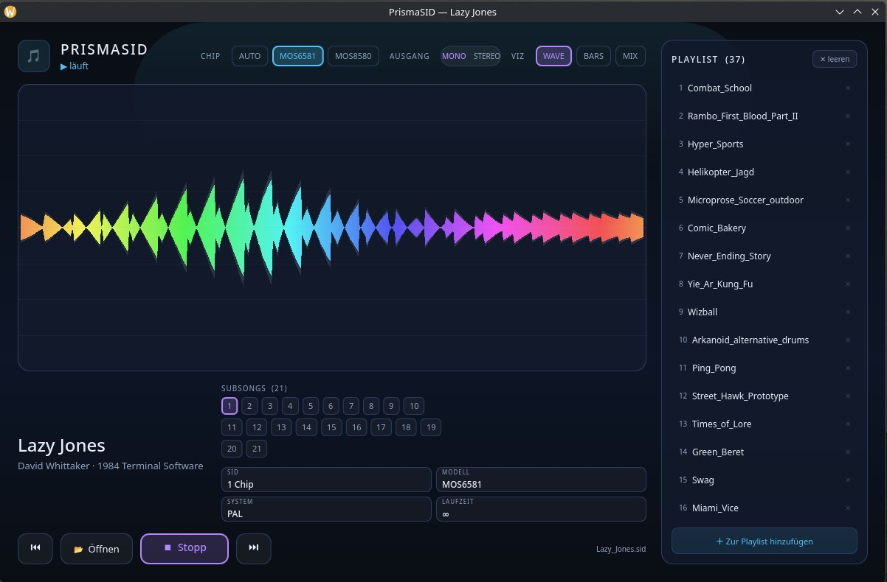

# PrismaSID 🌈

**Der erste moderne SID-Player seit Jahrzehnten.**

PrismaSID ist ein ultramoderner Player für C64-Chipmusik (SID-Dateien) — mit dunkler Glas-Oberfläche, GPU-beschleunigter Regenbogen-Visualisierung und vollem Funktionsumfang. Gebaut auf **libsidplayfp** (dem Goldstandard der SID-Emulation) und **Qt6**.



## Features

- 🎵 **SID-Playback** über libsidplayfp + reSIDfp — die genaueste 6581/8580-Emulation
- 🎚️ **Subsongs** (Umschaltung per Klick), **Chip-Modell** AUTO/MOS6581/MOS8580
- 🔊 **Stereo/Mono** — echtes L/R bei Dual-/Triple-SID-Tunes
- 🌈 **3 Visualisierungen** (WAVE / BARS / MIX) mit animiertem Regenbogen-Verlauf — GPU-gerendert (Scene-Graph), ~0% CPU
- 📂 **Samba-/KDE-Orte** — Netzlaufwerke direkt durchstöbern (kioclient5/KIO mit KWallet-Credentials, asynchron)
- 🖼 **HVSC-Browsing** — zuschaltbare Cover-Kachel-Ansicht (cover.jpg/png in Album-Ordnern) oder klassische Liste
- 📋 **Playlist** mit Hinzufügen/Entfernen/Leeren, Ordner-Import (inkl. Unterordner) und **Persistenz** (letzte Playlist wird wiederhergestellt)
- 🎧 **Automatische Geräte-Umschaltung** — wechsle Kopfhörer/Lautsprecher während der Wiedergabe, der Sound zieht nahtlos um
- 🔤 Korrekte Umlaute (SID-Tags sind Latin-1)
- 🖥 Läuft auf KDE/Plasma (Wayland & X11), Arch-basierten Distros

## Build

**Abhängigkeiten:** Qt6 (Core, Gui, Qml, Quick, Multimedia, Concurrent), libsidplayfp, libresidfp, CMake ≥ 3.16, C++17-Compiler

**Debian/Ubuntu:**
```bash
sudo apt install qt6-base-dev qt6-declarative-dev qt6-multimedia-gstreamer \
                 libsidplayfp-dev libresidfp-dev cmake g++
```

**Arch/CachyOS:**
```bash
sudo pacman -S qt6-base qt6-declarative qt6-multimedia gstreamer libsidplayfp cmake
```

**Bauen:**
```bash
git clone https://github.com/Shadowwrath73/PrismaSID.git
cd PrismaSID
cmake -B build
cmake --build build
./build/prismasid            # startet leer
./build/prismasid song.sid   # startet und spielt sofort
```

## AppImage

Das [AppImage](https://github.com/Shadowwrath73/PrismaSID/releases) (x86_64) bündelt die SID-Engine und nutzt Qt6/GStreamer vom System — auf Debian/Ubuntu einmalig:

```bash
sudo apt install qt6-base-dev qt6-declarative-dev qt6-multimedia-gstreamer libsidplayfp-dev libresidfp-dev
./PrismaSID-x86_64.AppImage
```

> Hinweis: Samba-/Netzlaufwerk-Orte (KDE-Places) erscheinen nur auf Systemen mit KIO/kioclient5 (KDE/Plasma). Auf anderen Desktops bleiben die lokalen Ordner voll nutzbar.

## Windows

**Windows 10/11 (x86_64):** Einfach die [PrismaSID-Setup-1.0.0.exe](https://github.com/Shadowwrath73/PrismaSID/releases/download/v1.0.0/PrismaSID-Setup-1.0.0.exe) herunterladen, doppelklicken, durchklicken — fertig. Keine weiteren Abhängigkeiten nötig (Qt6, FFmpeg und die SID-Engine sind komplett im Installer enthalten).

**Portabel:** Alternativ den Inhalt des Installers in einen beliebigen Ordner entpacken (`PrismaSID-Setup-1.0.0.exe /VERYSILENT /DIR=C:\PrismaSID`) und `prismasid.exe` direkt starten.

> Hinweis: Samba-/Netzlaufwerk-Orte (KDE-Places) gibt es unter Windows nicht — die lokalen Ordner und der Datei-Browser sind voll nutzbar.

## Bedienung

- **📂 Öffnen** — Datei-Browser mit KDE-Orten (auch Samba): Klick auf Song spielt sofort
- **＋ Zur Playlist** — Songs oder ganze Ordner (mit Unterordnern) zur Playlist
- **🖼 Cover** — schaltet die Cover-Kachel-Ansicht um (Cover-Bilder müssen in den Album-Ordnern liegen)
- **VIZ** — WAVE / BARS / MIX Visualisierung
- **CHIP** — AUTO / MOS6581 / MOS8580 Emulation
- **AUSGANG** — MONO / STEREO (Stereo nur hörbar bei Tunes mit ≥2 SID-Chips)

Die Playlist wird automatisch in `~/.config/sidplayer/playlist.json` gespeichert.

## Lizenz

BSD-3-Clause — siehe [LICENSE](LICENSE).

Copyright © 2026 Nika & Mike
